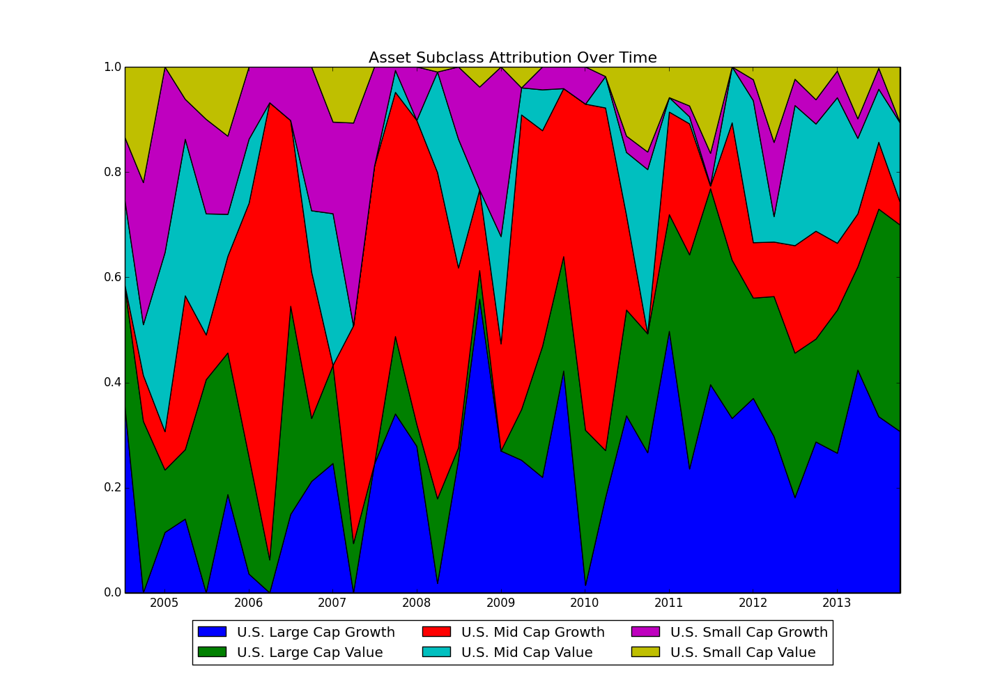

#asset_class

A simple library that uses r-squared maximization techniques and asset sub class ETFs (that I 
personally chose) to determine asset class information, as well as historical asset subclass information for a given asset

##Installation

 	$git clone https://github.com/benjaminmgross/asset_class
 	$ cd asset_class
 	$python setup.py install

##Quickstart

Let's say we had some fund, for instance the [Franklin Templeton Growth Allocation Fund A](http://finance.yahoo.com/q/pr?s=FGTIX+Profile) -- ticker FGTIX -- against which we we wanted to do historical attribution.

In just a couple of key strokes, we can come up with quarterly attribution analysis to see 
where returns were coming from

	import pandas.io.data as web
	import asset_class
	
	fgtix = web.DataReader('FGTIX', 'yahoo', start = '01/01/2000')['Adj Close']
	rolling_weights = asset_class.asset_class_and_subclass_by_interval(fgtix, 'quarterly')
	

And that's it.  Let's see the subclass attributions that adjusted r-squared algorithm came up
with.

	import matplotlib.pyplot as plt
	
	#create the stacked area graph
	fig = plt.figure()
	ax = plt.subplot2grid((1,1), (0,0))
	stack_coll = ax.stackplot(rolling_attr.index, rolling_attr.values.transpose())
	ax.set_ylim(0, 1.)
	proxy_rects = [plt.Rectangle( (0,0), 1, 1, 
		fc = pc.get_facecolor()[0]) for pc in stack_coll]
	ax.legend(proxy_rects, rolling_attr.columns.values.tolist(), ncol = 3, 
		loc = 8, bbox_to_anchor = (0.5, -0.15))
	plt.title("Asset Subclass Attribution Over Time", fontsize = 16)
	plt.show()
	

	

##Dependencies

###Obvious Ones:

`pandas`
`numpy`
`scipy.optimize` (uses the `TNC` method to optimize the objective function of r-squared)

###Not So Obvious:
Another one of my open source repositories
[`visualize_wealth`](https://github.com/benjaminmgross/wealth-viz)
> But that's just for adjusted r-squared functionality, you could easily clone and hack it yourself without that library

##Status

Still very much a WIP, although I've added [Sphinx]http://sphinx-doc.org/) docstrings to auto generate documentation

##To Do:
- Given a `pandas.DataFrame` of asset prices, and asset price weights, return an
  aggregated asset class `pandas.DataFrame` on a quarterly basis

- 

